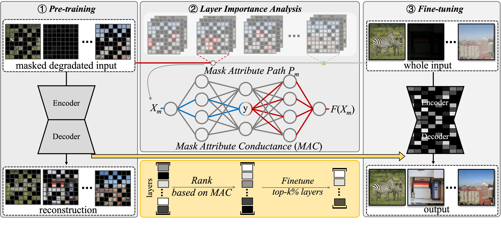

# <p align=center> :fire: `RAM-Jittor`</p>
This is the official Jittor version of codes for the paper.  For the PyTorch version, please refer to [RAM](https://github.com/Dragonisss/RAM).
>**Restore Anything with Masks：Leveraging Mask Image Modeling for Blind All-in-One Image Restoration**<br>  [Chujie Qin](https://github.com/Dragonisss), [Ruiqi Wu](https://rq-wu.github.io/), [Zikun Liu](), [Xin Lin](https://linxin0.github.io/), [Chunle Guo](https://scholar.google.com/citations?user=RZLYwR0AAAAJ&hl=en), [Hyun Hee Park](s), [Chongyi Li<sup>*</sup>](https://li-chongyi.github.io/) （ * indicates corresponding author)<br>
> European Conference on Computer Vision (ECCV), 2024



### :rocket: Highlights:
- RAM is a Blind All-In-One Image Restoration framework that can simultaneously handle <b style='font-size: large'>7 Restoration Tasks</b>  and achieve <b style='font-size: large'>SOTA performance</b> !
- RAM focus on tackling how to extract <b style='font-size: large'>Image Prior</b> instead of degradation prior from diverse corrupted images by Leveraging <b style='font-size: large'>Mask Image Modeling</b>.


## :wrench: Dependencies and Installation
1. Clone and enter our repository:
    ```bash
   git clone https://github.com/Dragonisss/RAM-Jittor.git RAM
   cd RAM-Jittor
    ```
2. Simply run the `install.sh` for installation!
    ```sh
    source install.sh
    ```
3. Activate the environment whenever you test!
    ```bash
    conda activate RAM_jit
    ```
## :sparkles: Datasets and Pretrained Models
> Given the number of datasets involved, we plan to offer a unified download link in the future to make it easier to access all datasets.

We combine datasets from various restoration tasks to form the training set. Here are the relevant links for all the datasets used:
<table>
<thead>
  <tr>
    <th> Dataset </th>
    <th> Phase </th>
    <th> Source </th>
    <th> Task for</th>
  </tr>
</thead>
<tbody>
  <tr>
    <td>OTS_ALPHA </td>
    <th>Train </th>
    <th> [<a href=https://pan.baidu.com/s/1wBE9wh9nXkvcJ6763CX1TA>Baidu Cloud(f1zz)</a>]</th>
    <th> Dehaze </th>
  </tr>
  <tr>
    <td> Rain-13k </td>
    <th> Train & Test </th>
    <th>[<a href='https://drive.google.com/drive/folders/1Hnnlc5kI0v9_BtfMytC2LR5VpLAFZtVe'>Google Drive</a>] </th>
    <th> Derain </th>
  </tr>
  <tr>
    <td> LOL-v2 </td>
    <th> Train & Test </th>
    <th> [Real Subset <a href=https://pan.baidu.com/share/init?surl=pQW7zq4yqU1zMRrlotxkXg>Baidu Cloud(65ay)</a>] / [Synthetic Subset <a href=https://pan.baidu.com/share/init?surl=t5OYgDgk3mQO53OXqW7QEA>Baidu Cloud(b14u)</a>] </th>
    <th> Low Light Enhancement </th>
  </tr>
  <tr>
    <td> GoPro </td>
    <th> Train & Test </th>
    <th> [<a href=https://drive.google.com/file/d/1y4wvPdOG3mojpFCHTqLgriexhbjoWVkK/view?usp=sharing>Download</a>] </th>
    <th> Motion Deblur </th>
  </tr>
    <tr>
    <td> LSDIR </td>
    <th> Train & Test </th>
    <th> [<a href=https://data.vision.ee.ethz.ch/yawli/index.html>HomePage</a>] </th>
    <th> Denoise DeJPEG DeBlur </th>
  </tr>
  </tr>
    <tr>
    <td> SOTS </td>
    <th> Test </th>
    <th> [<a href="https://www.kaggle.com/datasets/balraj98/synthetic-objective-testing-set-sots-reside?resource=download"l>Download</a>] </th>
    <th> Denoise DeJPEG DeBlur </th>
  </tr>
  </tr>
    <tr>
    <td> CBSD68 </td>
    <th> Test </th>
    <th> [<a href="https://github.com/clausmichele/CBSD68-dataset/tree/master"l>Download</a>] </th>
    <th> Denoise</th>
  </tr>
</tbody>
</table>
You need to collect required datasets above and place them under the `./datasets` Directory.

**Symbolic links** is a recommended approach, allowing you to place the datasets anywhere you prefer!

The final directory structure will be arranged as:
```
datasets
    |- CBSD68
        |- CBSD68
          |- noisy5
          |- noisy10
          |- ...
    |- gopro
        |- test
        |- train
    |- LOL-v2
        |- Real_captured
        |- Synthetic
    |- LSDIR
        |- 0001000
        |- 0002000
        |- ...
    |- OTS_ALPHA
        |- clear
        |- depth
        |- haze
    |- LSDIR-val
        |- 0000001.png
        |- 0000002.png
        |- ...
    |- rain13k
        |- test
        |- train
    |- SOTS
        |- outdoor
```

Our pipeline can be applied to any image restoration network. We provide the pre-trained and fine-tuned model files for SwinIR and PromptIR mentioned in the paper:
<table>
<thead>
  <tr>
    <th> Method </th>
    <th> Phase </th>
    <th> Framework </th>
    <th> Download Links </th>
    <th> Config File </th>
  </tr>
</thead>
<tbody>
  <tr>
    <td>RAM </td>
    <th> Pretrain </th>
    <th> SwinIR </th>
    <th> [<a href="https://drive.google.com/file/d/1MsFZe50V5o-ASVBeCY92F1POfJtbLH_D/view?usp=drive_link">GoogleDrive</a>] </th>
    <th> [<a href="options/RAM_SwinIR/ram_swinir_pretrain.yaml">options/RAM_SwinIR/ram_swinir_pretrain.yaml</a>] </th>
  </tr>
   <tr>
    <td>RAM </td>
    <th> Finetune </th>
    <th> SwinIR </th>
    <th> [<a href="https://drive.google.com/file/d/1IHQ9Yw2ajY8oYTKfZkdOgnSk0iexKNj5/view?usp=drive_link">GoogleDrive</a>] </th>
    <th> [<a href="options/RAM_SwinIR/ram_swinir_finetune.yaml">options/RAM_SwinIR/ram_swinir_finetune.yaml</a>] </th>
  </tr>
    <tr>
    <td>RAM </td>
    <th> Pretrain </th>
    <th> PromptIR </th>
    <th> [<a href="https://drive.google.com/file/d/191nk9er4v00Z1RuW6hRGSKb4LlEF0O8a/view?usp=drive_link">GoogleDrive</a>] </th>
    <th> [<a href="options/RAM_PromptIR/ram_promptir_pretrain.yaml">options/RAM_PromptIR/ram_promptir_pretrain.yaml</a>] </th>
  </tr>
    <tr>
    <td>RAM </td>
    <th> Finetune </th>
    <th> PromptIR </th>
    <th> [<a href="https://drive.google.com/file/d/1cqQoUxMNNVFcsR6lKHdZb-2Se80APlcQ/view?usp=drive_link">GoogleDrive</a>] </th>
    <th> [<a href="options/RAM_PromptIR/ram_promptir_finetune.yaml">options/RAM_PromptIR/ram_promptir_finetune.yaml</a>] </th>
  </tr>
</tbody>
</table>

## :camera: Quick Demo
We provide scripts for inference your own images in [inference.py](inference.py). <br/>
You could run `python inference.py --help` to get detailed information of this scripts.

## :robot: Training RAM With Jittor From Scratch!
Before proceeding, please **ensure** that the relevant datasets have been prepared as required. Besides, Multi-GPU training and inference in Jittor depends on [OpenMPI](https://www.open-mpi.org/). The user can install OpenMPI according to the [Jittor Documentation](https://cg.cs.tsinghua.edu.cn/jittor/assets/docs/jittor.mpi.html).

**1.Pretraining with MIM**
We use the collected datasets for model training. First, we execute the following command:
```sh
mpirun -np [num of gpus] python -m train \
-opt [OPT]

# e.g.
mpirun -np 8 python -m train \
-opt options/RAM_SwinIR/ram_swinir_pretrain.yaml
```

**2.Mask Attribute Conductance Analysis**

We use proposed Mask Attribute Conductance Analysis to analyze the importance of different layers for finetuning. You can run the following command to conduct MAC analysis:
```sh
python scripts/mac_analysis.py -opt [OPT]

# e.g.
python scripts/mac_analysis.py \
-opt options/RAM_SwinIR/ram_swinir_mac.yml

```
For convenience, we have provided the analysis results of the two models, RAM-SwinIR and RAM-PromptIR, mentioned in the paper. You can find them in [./mac_analysis_result/](./mac_analysis_result/)

**3.Finetuning**
```sh
mpirun -np [num of gpus] python -m train \
-opt [OPT]

# e.g.
mpirun -np 8 python -m train \
-opt options/RAM_SwinIR/ram_swinir_finetune.yaml
```
You can also add `CUDA_DEVICE_VISIBLE=` to choose gpu you want to use.


## :chart_with_upwards_trend: Evaluation 
We have provided a script for fast evaluation:
```sh
python ram/test.py \
-opt [OPT]
```
To benchmark the performance of RAM on the test dataset, you can run the following command:
```sh
# RAM-SwinIR
python test.py \
-opt options/test/ram_swinir_benchmark.yml

# RAM-PromptIR
python test.py \
-opt options/test/ram_promptir_benchmark.yml
```
## :book: Citation

If you find our repo useful for your research, please consider citing our paper:

```bibtex
@inproceedings{qin2024restore,
  title={Restore Anything with Masks: Leveraging Mask Image Modeling for Blind All-in-One Image Restoration},
  author={Qin, Chu-Jie and Wu, Rui-Qi and Liu, Zikun and Lin, Xin and Guo, Chun-Le and Park, Hyun Hee and Li, Chongyi},
  booktitle={European Conference on Computer Vision},
  pages={364--380},
  year={2024},
  organization={Springer}
}
```

## :postbox: Contact

For technical questions, please contact `chujie.qin[AT]mail.nankai.edu.cn`